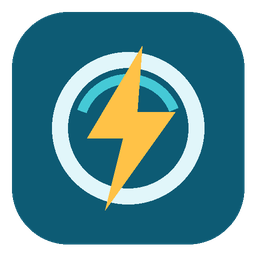

# KraftPlugg for Home Assistant

  

An unofficial Home Assistant integration for the Haugaland Kraft **KraftPlugg**
HAN reader. It signs in through Mitt Hjem using your phone number and an SMS
code, discovers the meters on your account, and exposes live electricity data in
Home Assistant.

> [!IMPORTANT]
> This is a community project and is not affiliated with, endorsed by, or
> supported by Haugaland Kraft. It uses the cloud API used by the Mitt Hjem app.
> That API is undocumented and may change without notice.

## Features

- Current imported power in watts
- Imported energy since local midnight in kWh
- Reader temperature
- Last contact timestamp
- Reader connectivity status
- UI setup with phone number and one-time SMS code
- Automatic session renewal and Home Assistant reauthentication flow
- Multiple meter locations on one Mitt Hjem account
- Redacted diagnostics for troubleshooting

## Installation

### HACS

1. Open the button above, or add
   `https://github.com/insihi/kraftplug` as an **Integration**
   under **HACS > Custom repositories**.
2. Download **KraftPlugg** in HACS.
3. Restart Home Assistant.
4. Open **Settings > Devices & services > Add integration** and search for
   **KraftPlugg**.

### Manual

Copy `custom_components/kraftplugg` into the `custom_components` directory in
your Home Assistant configuration, restart Home Assistant, and add KraftPlugg
from **Settings > Devices & services**.

## Setup

1. Enter the Norwegian phone number registered in Mitt Hjem.
2. Enter the one-time code sent by SMS.
3. If the account has more than one meter, choose the location to add.

The integration polls current power every 30 seconds. Energy, temperature, and
reader status are refreshed about every five minutes to avoid unnecessary cloud
calls.

## Data and privacy

Authentication is performed directly between Home Assistant and Haugaland
Kraft's services. Access and refresh credentials are stored in the Home Assistant
config entry and are never included in diagnostics. This integration does not
send analytics or account data anywhere else.

## Troubleshooting

- Confirm that the same phone number works in the Mitt Hjem app.
- Wait for a new SMS code if a previous one has expired.
- After installing or upgrading through HACS, restart Home Assistant.
- Download diagnostics from the KraftPlugg device page when opening an issue.
  The integration masks meter identifiers and excludes credentials.

## Support

Report bugs and API changes in the
[GitHub issue tracker](https://github.com/insihi/kraftplug/issues).
Do not include SMS codes, phone numbers, access tokens, refresh cookies, or full
meter identifiers in an issue.

## License

This project is licensed under the [MIT License](LICENSE). Product names and
trademarks belong to their respective owners.
